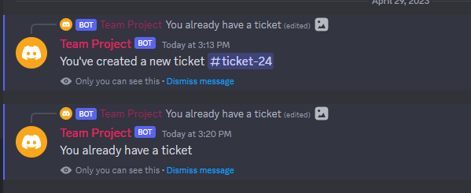

# We Built a Discord Bot

## Table of Contents

- [The Big Idea](#the-big-idea)
- [Installation](#installation)
- [Implementation Information](#implementation-information)
- [Project Evolution](#project-evolution)
- [Results](#results)
- [Contributing](#contributing)

## The Big Idea
We wanted to make this because we both use Discord very often and wanted to get more familiar with the application we use daily. The purpose of this bot was to be a playground for us to try out cool features and play around with the Pycord library. As a result, we made a ban command for basic moderation, utilized https://thecatapi.com/ to bring you adorable cats (as well as https://zenquotes.io/ for some inspirational quotes), and made a full ticket system with the ability to add users, store ticket IDs + users in an external database, and save transcripts of the conversation. We also added a quick feature that lets you ping the bot to make sure it's alive, if it doesn't respond with pong, call 911 (that's a joke, please don't actually call 911 if it doesn't respond).

## Installation
1. Install Python 3.9 
2. Go to file directory, right click and open terminal
3. Run `pip install -r requirements.txt` (Credit: https://stackoverflow.com/questions/31684375/automatically-create-requirements-txt)
4. Put your discord bot token (accessible under discord developer portal), transcript channel id, and mongodb url (accessible through mongodb atlas) in settings.py file
5. Invite the bot to your server (discord developer portal -> oauth2 -> url)
6. Then run `python discord_bot.py` 

### Commands
!ban {user} or /ban {user}: Will ban the user from your guild

!ping or /ping: Will respond with pong

!panel: Will open up a panel where users can click on a button to create a ticket

!add {user} or /add {user}: Will add a user to your ticket

!close or /close: Will close the ticket, send a transcript to the user and the transcript channel

!cat or /cat: Will send an embed with a cat image and inspirational quote

## Implementation Information

## Project Evolution
We started the project by really talking to each other and pinpointing the key things that we wanted from this project, and developing a project timeline that will help us get to there. We broke the project into various steps,

1. Create a Discord account and a new application
2. Choose frameworks that best represents the project, suits the needs of our bot and something we were most comfortable working with
3. We then started writing code for the bot
4. There were immediate instance where we were writing and testing the code right away and but we as we finished a MVP we really made sure that it wokred as expeted and doesn't have any bugs 
7. The second last piece was the deployment where wee basically invited and ran the bot in various servers
8. Lastly once when had a MVP we really worked to add other fuctionalities such as being able to send funny cat memes 

## Results
Upon installation, our can perform the tasks seen in commands.

### Tickets

## Contributing
We used some help from ChatGPT, individuals, and internet sources such as Reddit.
