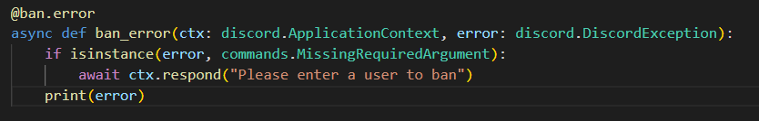

# We Built a Discord Bot

## Table of Contents

- [The Big Idea](#the-big-idea)
- [Installation](#installation)
- [Implementation Information](#implementation-information)
- [Project Evolution](#project-evolution)
- [Results](#results)
- [Contributing](#contributing)

## The Big Idea
We wanted to make this because we both use Discord very often and wanted to get more familiar with the application we use daily. The purpose of this bot was to be a playground for us to try out cool features and play around with the Pycord library. As a result, we made a ban command for basic moderation, utilized https://thecatapi.com/ to bring you adorable cats (as well as https://zenquotes.io/ for some inspirational quotes), and made a full ticket system with the ability to add users, store ticket IDs + users in an external database, and save transcripts of the conversation. We also added a quick feature that lets you ping the bot to make sure it's alive, if it doesn't respond with pong, call 911 (that's a joke, please don't actually call 911 if it doesn't respond).

## Installation
1. Install Python 3.9 
2. Go to file directory, right click and open terminal
3. Run `pip install -r requirements.txt` (Credit: https://stackoverflow.com/questions/31684375/automatically-create-requirements-txt)
4. Put your discord bot token (accessible under discord developer portal), transcript channel id, and mongodb url (accessible through mongodb atlas) in settings.py file
5. Invite the bot to your server (discord developer portal -> oauth2 -> url)
6. Then run `python discord_bot.py` 

### Commands
!ban {user} or /ban {user}: Will ban the user from your guild

!ping or /ping: Will respond with pong

!panel: Will open up a panel where users can click on a button to create a ticket

!add {user} or /add {user}: Will add a user to your ticket

!close or /close: Will close the ticket, send a transcript to the user and the transcript channel

!cat or /cat: Will send an embed with a cat image and inspirational quote

## Implementation Information
1. Import necessary modules and packages
2. Create bot object with prefix and permissions
3. Register on_ready event to print message and add custom UI panel
4. Register ping, ban, add, cat, and close commands
5. Define error handling function for ban command
6. Define Panel_Options class, inheriting from discord.ui.View, with a single button labeled "Open a Ticket"
7. Define callback function for "Open a Ticket" button click event, which creates a new text channel in the "tickets" category with the name "ticket-{user name}"
8. Define on_message event to handle messages in "tickets" text channels, checking if they are commands and executing appropriate function
9. Define close command to export ticket transcript and send to specified channel before deleting ticket channel.

start -> bot object creation -> register on_ready event -> register custom UI panel -> 
         register bridge commands -> register error handling function -> define Panel_Options class -> 
         define callback function -> register on_message event -> define close command -> end

## Project Evolution
We started the project by really talking to each other and pinpointing the key things that we wanted from this project, and developing a project timeline that will help us get to there. We broke the project into various steps,

1. Create a Discord account and a new application
2. Choose exactly what we wanted to do, which was have fun! But we knew we had to start with the basics...
3. We then started writing code for the bot, basics first and created a virtual environmnet for testing purposes... 
We tried just having something happen when the bot is ran, which is what we did. We couldn't think more simple than that and we had the opportunity to play around with events.

4. Then we dove even deeper with bridge commands...

5. And then EVEN DEEPER with error messages, Mongo, and OOP!

6. And lastly, to celebrate our MVP, we wanted to add one last thing... something that would make anyone playing around with our bot smile... Cats! 

## Results
Upon installation, here are a few cool things that our bot can do!

### Tickets

### Archiving

### Ping

### Cats!🐈

### Ban

## Contributing
We used some help from ChatGPT, individuals, and internet sources such as Reddit.
